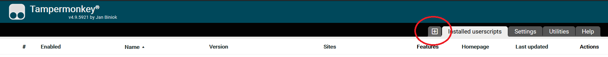
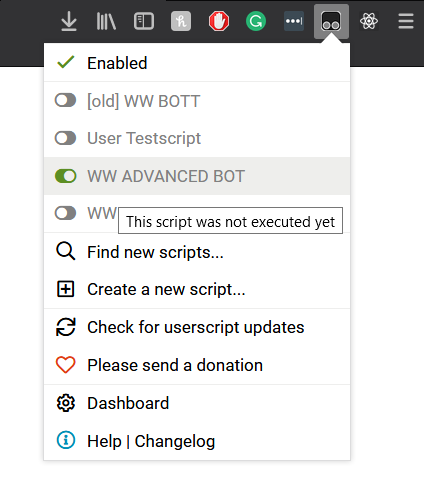
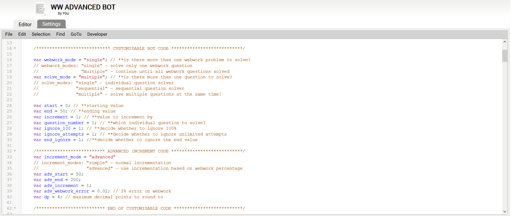

# webwork-bot
This bot uses javascript to apply brute force in answering online webwork questions.
Disclaimer: Use of this bot may cause over +100 attempts easily.

Due to the need for the page to reload after every submit, the code works by being injected into the browser's console by the use of an external extension.

# Instructions
1. Download [TamperMonkey](https://www.tampermonkey.net/) as a browser extension (compatible with Chrome, Firefox, Opera, etc)
2. Navigate to the dashboard of the extension and "create a new script"

3. Copy and paste the entire code from one of the scripts in this repository, and save before exiting
4. Log on to webwork and open a question
5. Enable the script through TamperMonkey, which should be accessible from the browser toolbar

*-->Ensure that TamperMonkey is enabled and not hidden in the browser toolbar*

6. Enjoy! :tada:

*-->The script is made to run only on tabs where webwork is currently opened. In order to force the script to stop running, navigate to TamperMonkey's dashboard and disable from there*

# Usage
In order to use the bot, simple understanding of a few lines of code is needed. Please read the comments on the different sections and **only alter code that is marked as customizable**

Version 1 of the code uses a browser extension called "tampermonkey"
( which can be downloaded from [here](https://tampermonkey.net/) )
in order to run and inject the script into the browser console on every reload.

### Author's Note
The author is and will not be responsible for the misuse of the script.
